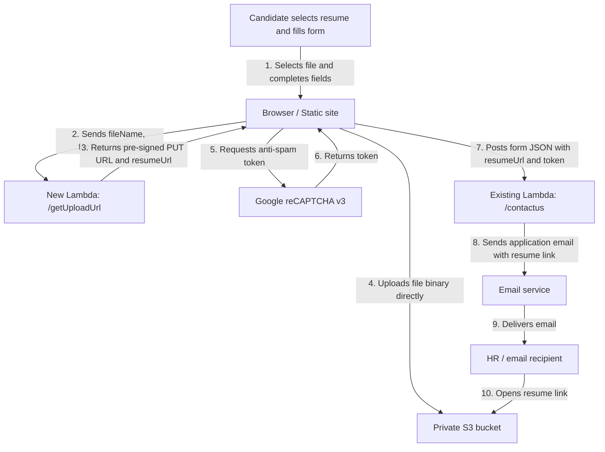
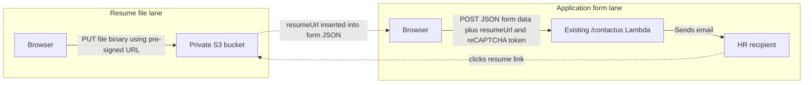

# Job Application Form — Resume Upload: S3 Pre-signed URL Execution Plan

**Date:** 2026-05-07  
**Branch:** form-uploader  
**Author:** Kevin Wong  

---

## Current Infrastructure Context

### Form
- **File:** `en/about-us/job-listings.html`
- **Form ID:** `#wf-form-Job-Application-Form`
- **Native action:** `http://ioioleo.com/form-webmailContacts.asp` (bypassed via JS)
- **Fields:** First Name, Last Name, Email, Phone, Job Position (dropdown), Company (auto-filled), Message

### Form Submission Flow
```
User fills form
  → reCAPTCHA v3 token generated (grecaptcha.execute)
    → submitToAPI(e) called
      → jQuery AJAX POST (async: false)
        → AWS Lambda (ap-southeast-1)
          → Lambda sends email via SES/SMTP
```

### Lambda Endpoint
```
POST https://uudwr4nux0.execute-api.ap-southeast-1.amazonaws.com/APIStage/contactus
```
**Payload fields:**
```json
{
  "firstName": "",
  "lastName": "",
  "email": "",
  "phone": "",
  "position": "",
  "company": "",
  "message": "",
  "htmlContent": "",
  "recaptchaToken": "",
  "Iswebflow": 1,
  "toRecipient": 22,
  "emailSubject": "Job Application Form",
  "ccRecipient": 0,
  "bccRecipient": 1
}
```

**Recipient routing logic (in `js/job-listings.js`):**
| Company | `toRecipient` |
|---|---|
| IOI Acidchem Sdn. Bhd. / IOI Esterchem (M) Sdn. Bhd. | `22` |
| IOI Pan-Century Edible Oils / Oleochemicals Sdn. Bhd. | `23` |
| Anything else | Aborts with alert |

### Key JS File
- **`js/job-listings.js`** — contains `submitToAPI()`, reCAPTCHA binding, job toggle accordion, CMSSelect sync

### Constraints
- No server-side backend under our control (ASP at `ioioleo.com` is legacy, not used)
- Lambda source code is managed externally (AWS console or IaC)
- Static site: no Node.js server, no PHP — only HTML/CSS/JS
- File size limit target: **5 MB**
- Supported file types: **PDF, DOC, DOCX**
- Must not break existing reCAPTCHA → submitToAPI flow

---

## Recommended Approach: AWS S3 Pre-signed URL Upload

### Overview
A second Lambda function generates a temporary pre-signed S3 upload URL. The frontend uploads the file directly to S3 using that URL, then passes the resulting S3 object URL to `submitToAPI()` as an additional field. The existing Lambda email function includes the resume URL in the email body.

This keeps the heavy file upload out of the existing `/contactus` Lambda. The existing Lambda continues to receive normal form data, plus a resume link. S3 handles the file binary.

## Full Pipeline Visual

### End-to-End Flow


### Two Separate Lanes



### Parties Involved

| Party | Role | Owns / Controls |
|---|---|---|
| **Candidate** | Fills in job application form and attaches resume | Browser, selected resume file |
| **Static website** | Hosts `job-listings.html` and `job-listings.js` | HTML form, upload UI, client-side validation |
| **Google reCAPTCHA v3** | Provides bot/spam risk token before final form submission | reCAPTCHA token generation |
| **New Lambda: `/getUploadUrl`** | Issues temporary S3 upload URL after validating file metadata | File type/size validation, S3 key naming, pre-signed URL |
| **Amazon S3 bucket** | Stores uploaded resume files privately | Resume file objects under `resumes/` prefix |
| **Existing Lambda: `/contactus`** | Receives form payload and sends email | Existing recipient routing, email body, reCAPTCHA verification |
| **Email recipient / HR** | Receives application email and resume link | Final review workflow |
| **AWS IAM** | Allows new Lambda to create pre-signed S3 PUT URLs | Permission boundary for S3 upload path |
| **API Gateway** | Exposes `/getUploadUrl` and existing `/contactus` over HTTPS | Public API routes + CORS |

### Responsibility Split

| Area | Frontend | AWS / Backend |
|---|---|---|
| File picker UI | Yes | No |
| 5 MB client-side validation | Yes | Also revalidated in Lambda |
| File type client-side validation | Yes | Also revalidated in Lambda |
| Actual file upload | Browser performs direct PUT | S3 receives file |
| File storage | No | S3 |
| Resume link in form payload | Yes | Existing Lambda receives it |
| Email delivery | No | Existing Lambda |
| reCAPTCHA token generation | Browser | Existing Lambda verifies |

### Why This Pipeline Is Safer Than Sending the File to `/contactus`

- The existing Lambda receives only JSON form data and a resume URL, not a 5 MB binary attachment.
- API Gateway/Lambda payload limits are avoided.
- S3 is purpose-built for file upload/storage.
- The S3 bucket can stay private; candidates only receive a short-lived upload URL.
- The new Lambda has a narrow IAM policy: it can only write to `resumes/*`.
- Resume retention can be controlled with an S3 lifecycle rule.

---

### Phase A — AWS Infrastructure Setup

#### A1. Create S3 Bucket
- **Bucket name:** `ioi-oleochemical-job-applications` (or similar)
- **Region:** `ap-southeast-1` (match existing Lambda region)
- **Block public access:** Keep ON (files accessed via pre-signed URL only)
- **Versioning:** Optional, recommended OFF for simplicity
- **CORS configuration** (required for browser PUT upload):
```json
[
  {
    "AllowedHeaders": ["*"],
    "AllowedMethods": ["PUT"],
    "AllowedOrigins": [
      "https://www.ioioleochemical.com",
      "https://ioioleochemical.com",
      "http://localhost:*"
    ],
    "ExposeHeaders": ["ETag"],
    "MaxAgeSeconds": 3600
  }
]
```
- **Object expiry lifecycle rule:** Auto-delete objects after 90 days (optional, keeps storage costs minimal)

#### A2. Create IAM Policy for Pre-sign Lambda
```json
{
  "Version": "2012-10-17",
  "Statement": [
    {
      "Effect": "Allow",
      "Action": ["s3:PutObject"],
      "Resource": "arn:aws:s3:::ioi-oleochemical-job-applications/resumes/*"
    }
  ]
}
```
- Attach to a new IAM role: `LambdaJobResumeUploadRole`

#### A3. Create New Lambda — `getJobResumeUploadUrl`
- **Runtime:** Node.js 20.x
- **Region:** `ap-southeast-1`
- **Trigger:** API Gateway (same gateway as existing `/contactus`, new route `/getUploadUrl`)
- **Memory:** 128 MB, **Timeout:** 10s

**Lambda source (`getJobResumeUploadUrl/index.mjs`):**
```javascript
import { S3Client, PutObjectCommand } from "@aws-sdk/client-s3";
import { getSignedUrl } from "@aws-sdk/s3-request-presigner";
import { randomUUID } from "crypto";

const s3 = new S3Client({ region: "ap-southeast-1" });
const BUCKET = "ioi-oleochemical-job-applications";
const ALLOWED_TYPES = ["application/pdf", "application/msword",
  "application/vnd.openxmlformats-officedocument.wordprocessingml.document"];
const MAX_SIZE = 5 * 1024 * 1024; // 5 MB

export const handler = async (event) => {
  const headers = {
    "Access-Control-Allow-Origin": "*",
    "Access-Control-Allow-Headers": "Content-Type",
    "Content-Type": "application/json"
  };

  if (event.httpMethod === "OPTIONS") {
    return { statusCode: 200, headers, body: "" };
  }

  let body;
  try { body = JSON.parse(event.body || "{}"); } catch { body = {}; }

  const { fileName, fileType, fileSize } = body;

  if (!fileName || !fileType || !fileSize) {
    return { statusCode: 400, headers, body: JSON.stringify({ error: "Missing fileName, fileType, or fileSize" }) };
  }
  if (!ALLOWED_TYPES.includes(fileType)) {
    return { statusCode: 400, headers, body: JSON.stringify({ error: "File type not allowed. Only PDF, DOC, DOCX." }) };
  }
  if (fileSize > MAX_SIZE) {
    return { statusCode: 400, headers, body: JSON.stringify({ error: "File exceeds 5 MB limit." }) };
  }

  const ext = fileName.split(".").pop().toLowerCase();
  const key = `resumes/${Date.now()}-${randomUUID()}.${ext}`;

  const command = new PutObjectCommand({
    Bucket: BUCKET,
    Key: key,
    ContentType: fileType,
    ContentLength: fileSize,
    // No ACL — bucket stays private
  });

  const uploadUrl = await getSignedUrl(s3, command, { expiresIn: 300 }); // 5 min TTL
  const fileUrl = `https://${BUCKET}.s3.ap-southeast-1.amazonaws.com/${key}`;

  return {
    statusCode: 200,
    headers,
    body: JSON.stringify({ uploadUrl, fileUrl })
  };
};
```

#### A4. Add API Gateway Route
- **Method:** `POST`
- **Path:** `/getUploadUrl`
- **Stage:** `APIStage` (same as existing)
- **Full URL:** `https://uudwr4nux0.execute-api.ap-southeast-1.amazonaws.com/APIStage/getUploadUrl`
- Enable CORS on this route in API Gateway console

#### A5. Update Existing Lambda (`/contactus`)
Add `resumeUrl` field handling to the email body construction:
```javascript
// In existing Lambda email body builder:
if (data.resumeUrl) {
  htmlContent += `Resume: <a href="${data.resumeUrl}">${data.resumeUrl}</a><br/><br/>`;
}
```

---

### Phase B — Frontend Changes

#### B1. Add File Input to Form in `en/about-us/job-listings.html`
Locate the job application form and add before the submit button:

```html
<!-- Resume Upload -->
<div class="form_field-wrapper">
  <label for="Applicant-Resume" class="form_label">
    Resume / CV <span style="font-weight:400;color:#888;">(PDF, DOC, DOCX — max 5MB)</span>
  </label>
  <input
    type="file"
    id="Applicant-Resume"
    name="Applicant-Resume"
    accept=".pdf,.doc,.docx,application/pdf,application/msword,application/vnd.openxmlformats-officedocument.wordprocessingml.document"
    class="form_input w-input"
    style="padding: 0.5rem;"
  />
  <div id="resume-upload-status" style="font-size:0.8rem;margin-top:0.25rem;color:#555;"></div>
</div>
```

#### B2. Update `js/job-listings.js`

**Add constants near top of file (after `let lenis;`):**
```javascript
var UPLOAD_URL_ENDPOINT = 'https://uudwr4nux0.execute-api.ap-southeast-1.amazonaws.com/APIStage/getUploadUrl';
var resumeS3Url = ''; // Global to hold uploaded resume URL
```

**Add `uploadResume()` helper function before `submitToAPI()`:**
```javascript
function uploadResume(file) {
  return new Promise(function(resolve, reject) {
    var statusEl = document.getElementById('resume-upload-status');
    if (statusEl) statusEl.textContent = 'Uploading resume...';

    $.ajax({
      type: 'POST',
      url: UPLOAD_URL_ENDPOINT,
      contentType: 'application/json; charset=utf-8',
      data: JSON.stringify({
        fileName: file.name,
        fileType: file.type,
        fileSize: file.size
      }),
      dataType: 'json',
      success: function(res) {
        if (!res.uploadUrl || !res.fileUrl) {
          reject(new Error('Invalid pre-sign response'));
          return;
        }
        // Upload file directly to S3 via PUT
        $.ajax({
          type: 'PUT',
          url: res.uploadUrl,
          contentType: file.type,
          data: file,
          processData: false,
          success: function() {
            if (statusEl) statusEl.textContent = 'Resume uploaded ✓';
            resolve(res.fileUrl);
          },
          error: function(xhr) {
            reject(new Error('S3 upload failed: ' + xhr.status));
          }
        });
      },
      error: function(xhr) {
        reject(new Error('Pre-sign request failed: ' + xhr.status));
      }
    });
  });
}
```

**Modify the form `submit` event handler** (inside the `forms.forEach` block) to upload file first:
```javascript
forms.forEach(function(form) {
  form.addEventListener('submit', function(e) {
    var tokenField = form.querySelector('#g-recaptcha-response');
    e.preventDefault();

    var fileInput = document.getElementById('Applicant-Resume');
    var file = fileInput && fileInput.files && fileInput.files[0];

    function proceedWithSubmit() {
      try {
        grecaptcha.ready(function() {
          grecaptcha.execute(SITE_KEY, { action: 'contact' }).then(function(token) {
            tokenField.value = token;
            return submitToAPI(e);
          });
        });
      } catch(exp) {
        console.log('Error: ' + exp.message);
        return false;
      }
    }

    if (file) {
      uploadResume(file).then(function(s3Url) {
        resumeS3Url = s3Url;
        proceedWithSubmit();
      }).catch(function(err) {
        alert('Failed to upload resume: ' + err.message + '\nPlease try again.');
      });
    } else {
      resumeS3Url = '';
      proceedWithSubmit();
    }
  });
});
```

**Update `submitToAPI()` to include `resumeUrl`:**
```javascript
// After:  data.message = externalMessage;
data.resumeUrl = resumeS3Url || '';

// Update htmlContent to include resume link:
var emailContent = 'First Name : ' + externalFirstName + '<br /><br />' +
  'Last Name : ' + externalLastName + '<br /><br />' +
  'Phone : ' + externalPhone + '<br /><br />' +
  'Email : ' + externalEmail + '<br /><br />' +
  'Position : ' + externalPosition + '<br /><br />' +
  'Company : ' + externalCompany + '<br /><br />' +
  'Message : ' + externalMessage + '<br /><br />' +
  (resumeS3Url ? 'Resume : <a href="' + resumeS3Url + '">' + resumeS3Url + '</a><br /><br />' : '');
```

---

### Phase C — Validation & UX

- Client-side file type check before upload attempt
- Client-side file size check (< 5 MB) before upload attempt
- Upload status indicator (`#resume-upload-status`)
- Submit button disabled during upload (optional UX improvement)
- Resume field is **optional** — form submits normally if no file selected

---

## Pros & Cons

| | |
|---|---|
| ✅ No third-party dependency | ✅ Files stay within AWS ecosystem |
| ✅ Integrates with existing Lambda infra | ✅ Controlled access, no public bucket |
| ✅ No ongoing per-upload cost beyond S3 storage | ❌ Requires AWS access to create Lambda + S3 + IAM |
| ❌ More setup steps | ❌ CORS config must be exact |
| ❌ Pre-signed URL has 5-min TTL (user must upload quickly) | |

---

## Recommended Implementation Order

1. Provision S3 bucket + CORS (30 min)
2. Create IAM role + policy (15 min)
3. Deploy `getJobResumeUploadUrl` Lambda + API Gateway route (45 min)
4. Update existing `/contactus` Lambda to render `resumeUrl` in email (15 min)
5. Add file input HTML to `job-listings.html` (15 min)
6. Update `job-listings.js` with `uploadResume()` + modified submit handler (1 hr)
7. Test end-to-end (30 min)

Total estimate: **3–4 hours of focused implementation**, excluding AWS access handoff / approval delays.

---

## Action Plan by Party

This plan assumes the safest practical collaboration model for an MNC:

- The **client/backend team keeps ownership of AWS**.
- We do **not** require shared AWS admin access.
- We provide the implementation package and frontend integration.
- Client deploys the AWS pieces first in **staging**.
- Client shares only the required staging endpoint and expected response contract.
- After joint sign-off, the client promotes the backend changes to production and shares the production endpoint.

### Your Side — Frontend Website / Implementation Partner

| Step | Action | Output | Realistic Effort |
|---|---|---|---|
| 1 | Prepare backend implementation package for client | S3 CORS config, IAM policy, Lambda source, API Gateway route spec, expected JSON response | 2–3 hrs |
| 2 | Add resume field to the playground job application form | A visible file field supporting PDF, DOC, DOCX, max 5 MB | 0.5–1 hr |
| 3 | Add frontend validation | Prevent invalid file type / file size before any upload attempt | 0.5–1 hr |
| 4 | Wait for client staging handoff | Need staging `/getUploadUrl` endpoint and response shape confirmation | No build time; dependent on client |
| 5 | Wire upload logic in `js/job-listings.js` against staging | Frontend requests upload URL, uploads file to S3, stores returned `resumeUrl` | 2–3 hrs |
| 6 | Submit existing application payload with `resumeUrl` | Existing `/contactus` form submission includes the resume link | 1–1.5 hrs |
| 7 | Add user feedback | Uploading / uploaded / failed states shown near the file field | 1–1.5 hrs |
| 8 | Browser/device testing in staging | Validate Chrome/Safari/mobile behavior and failed upload states | 1.5–2.5 hrs |
| 9 | Production endpoint swap after client sign-off | Replace staging endpoint with production endpoint | 0.25–0.5 hr |

**Frontend / implementation partner subtotal:** approximately **8.75–14 hours**.

### Client Side — AWS / Backend

| Step | Action | Output | Realistic Effort |
|---|---|---|---|
| A | Review and approve implementation package | Internal security/devops confirms S3, IAM, Lambda, CORS approach | 1–3 hrs |
| B | Create private staging S3 bucket | Private staging storage location for resume files | 0.5–1 hr |
| C | Configure staging S3 CORS | Browser can upload directly to S3 using pre-signed URL | 0.5–1.5 hrs |
| D | Create least-privilege IAM role / policy | New Lambda can write only to the `resumes/*` path | 1–2 hrs |
| E | Create staging `getJobResumeUploadUrl` Lambda | Validates file metadata and returns temporary upload URL + final resume URL | 2–4 hrs |
| F | Add staging API Gateway route | Public HTTPS staging endpoint: `/getUploadUrl` | 1–2 hrs |
| G | Share staging endpoint with frontend | Frontend can complete staging integration | 0.25 hr |
| H | Update existing staging `/contactus` Lambda | Email body includes `resumeUrl` as a clickable resume link | 1–2 hrs |
| I | Provide CloudWatch/API Gateway diagnostics during integration | Resolve CORS, IAM, timeout, or response-shape issues | 2–4 hrs |
| J | Promote approved setup to production | Production S3/Lambda/API Gateway/contactus changes deployed internally | 2–4 hrs |
| K | Share production endpoint with frontend | Final production `/getUploadUrl` endpoint available | 0.25 hr |

**Client/backend subtotal:** approximately **11.5–24 hours**.

### Joint QA

| Test | Expected Result | Realistic Effort |
|---|---|---|
| Staging upload test: valid PDF under 5 MB | Upload succeeds, form submits, email contains resume link | 0.5 hr |
| Staging upload test: DOC/DOCX under 5 MB | Upload succeeds, form submits, email contains resume link | 0.5–1 hr |
| Staging rejection test: file over 5 MB | Frontend blocks upload before calling AWS | 0.25–0.5 hr |
| Staging rejection test: unsupported type | Frontend blocks upload before calling AWS | 0.25–0.5 hr |
| Staging no-resume test | Form still submits normally | 0.25 hr |
| Staging resume-link test | Resume opens/downloads from S3 from received email | 0.25–0.5 hr |
| Regression check existing job form behavior | Existing no-upload form fields, reCAPTCHA, and recipient routing still work | 1–2 hrs |
| Production smoke test | One final production submission confirms upload, email, and resume link | 0.5–1 hr |

**Joint QA subtotal:** approximately **3.5–6.25 hours**.

### Realistic Total Effort

| Area | Estimate |
|---|---|
| Frontend / implementation partner | 8.75–14 hrs |
| Client/backend AWS implementation | 11.5–24 hrs |
| Joint QA and troubleshooting | 3.5–6.25 hrs |
| **Total combined effort** | **23.75–44.25 hrs** |

For planning, budget **3–6 working days end-to-end**, depending mostly on client security review, AWS deployment turnaround, CORS/IAM debugging, and how quickly the existing `/contactus` Lambda can be updated in staging and production.

### Access Model

Preferred for an MNC:

- Client does **not** share AWS root/admin access.
- Client backend/devops team deploys all AWS resources internally.
- If direct debugging access is needed, use a **time-boxed, least-privilege IAM role** with:
  - read access to relevant CloudWatch logs,
  - limited access only to the new upload Lambda/API Gateway/S3 bucket,
  - MFA where possible,
  - CloudTrail auditability,
  - automatic removal after implementation.

### Handoff Summary

| From | To | Handoff |
|---|---|---|
| Frontend | Client/backend | Required file rules: PDF/DOC/DOCX, max 5 MB |
| Frontend | Client/backend | Backend implementation package: S3 CORS, IAM policy, Lambda code, API Gateway route spec |
| Client/backend | Frontend | Staging `/getUploadUrl` endpoint URL |
| Client/backend | Frontend | Expected response shape: `{ uploadUrl, fileUrl }` |
| Frontend | Client/backend | Confirmed final payload includes `resumeUrl` |
| Client/backend | Frontend | Production `/getUploadUrl` endpoint URL after staging sign-off |
| Both | Client / HR reviewer | Confirm received production email includes working resume link |

Related diagram: `docs/job-resume-upload-pipeline.excalidraw`

---

## Files and Systems to Modify

| File | Change |
|---|---|
| `en/about-us/job-listings.html` | Add file input / upload widget to form |
| `js/job-listings.js` | Add upload logic, update `submitToAPI()` |
| AWS Lambda `/contactus` | Add `resumeUrl` to email HTML output |
| New Lambda `getJobResumeUploadUrl` | Create new function to return pre-signed S3 upload URL |
| S3 bucket | Create private bucket with CORS + optional lifecycle retention |
| IAM role / policy | Grant new Lambda permission to write only to `resumes/*` |
| API Gateway | Add `/getUploadUrl` route and CORS |

---

## Final Mental Model

Think of the resume upload as a two-lane road:

1. **Resume file lane:** Browser uploads the file directly to S3 using a short-lived one-time URL.
2. **Application form lane:** Browser sends normal form details to the existing `/contactus` Lambda, plus the S3 resume link.

The two lanes meet only inside the final email. This is the core design choice: **files go to S3, form data goes to Lambda**.

---

*End of plan. No implementation changes have been made here. This document is for planning and execution alignment only.*
